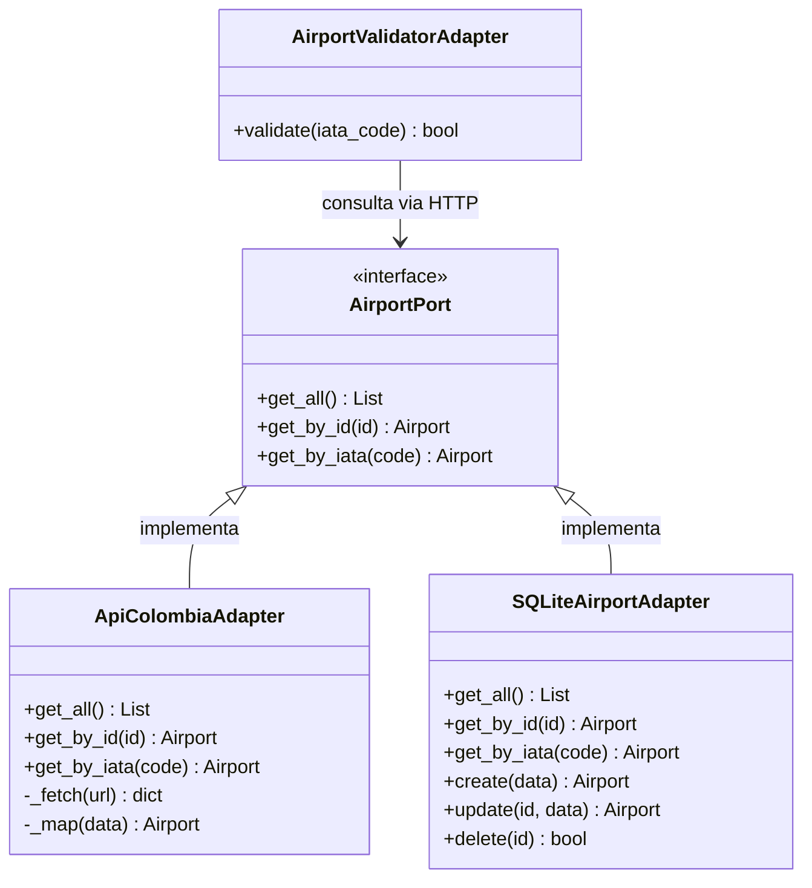
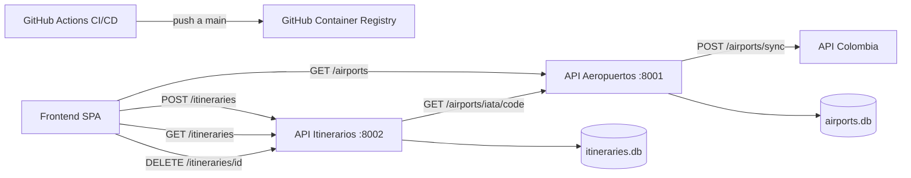
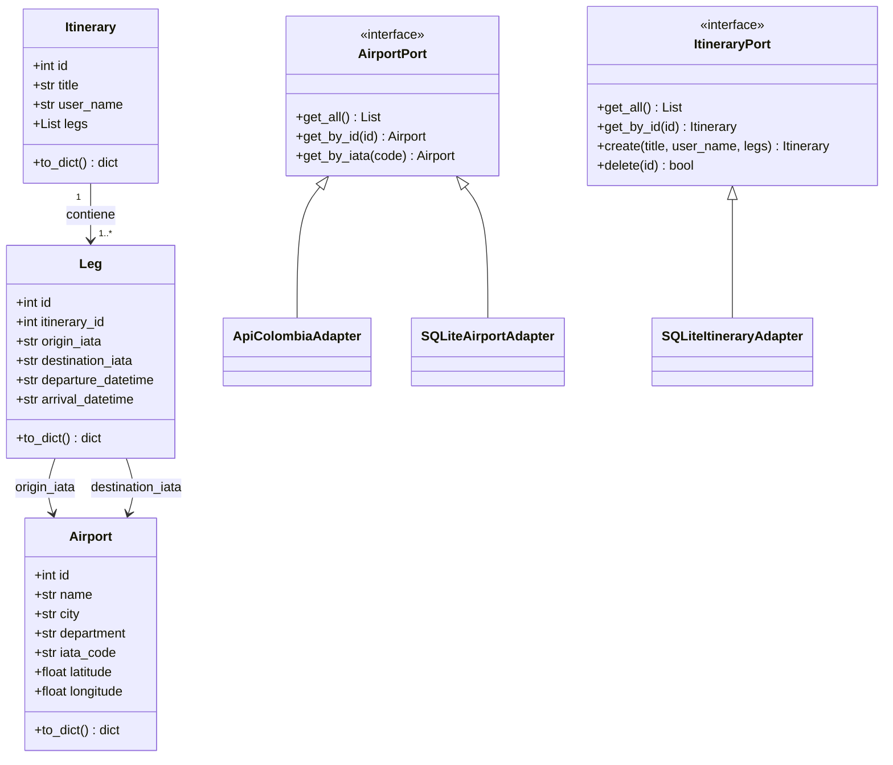
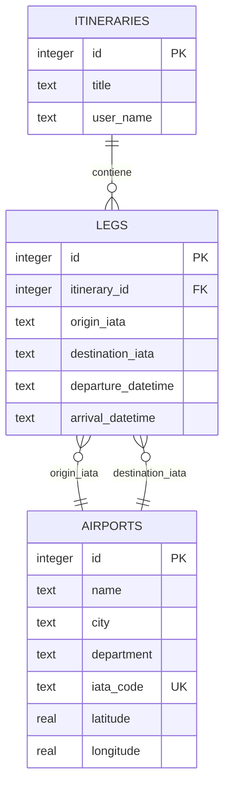

# ✈ Itinerary — Sistema de Gestión de Itinerarios de Viaje

Aplicación web para planificar itinerarios de viaje entre aeropuertos nacionales e internacionales, desarrollada como proyecto de Ingeniería de Software II en la Universidad Central.

---

## 🏗 Arquitectura Utilizada

El sistema implementa una **Arquitectura de Microservicios** con **Arquitectura Hexagonal** en cada servicio y el **Patrón Adapter** para el desacoplamiento de fuentes externas.

```mermaid
graph TB
  FE[Frontend SPA - HTML/CSS/JS + Leaflet.js]
  FE -->|REST HTTP GET /airports| API1[API Aeropuertos :8001]
  FE -->|REST HTTP POST/GET/DELETE /itineraries| API2[API Itinerarios :8002]
  API2 -->|valida IATA via HTTP| API1
  API1 --> DB1[(SQLite airports.db)]
  API2 --> DB2[(SQLite itineraries.db)]
  API1 -->|POST /airports/sync - Patron Adapter| EXT[API Colombia - fuente externa]

  subgraph HEX1[Arquitectura Hexagonal - Airport Service]
    DOM1[domain/models.py]
    PORT1[ports/airport_port.py]
    ADP1[adapters/api_colombia_adapter.py]
    INF1[infrastructure/database.py]
  end

  subgraph HEX2[Arquitectura Hexagonal - Itinerary Service]
    DOM2[domain/models.py]
    PORT2[ports/itinerary_port.py]
    ADP2[adapters/airport_validator.py]
    INF2[infrastructure/database.py]
  end
```



### Decisión sobre Leaflet vs Plotly
El sistema utiliza **Leaflet.js** en lugar de Plotly JS por su especialización en cartografía interactiva, soporte nativo de tiles geográficos (OpenStreetMap, CartoDB) y capacidad para renderizar rutas de vuelo como curvas de Bézier cuadráticas. Plotly es superior para gráficas estadísticas pero no para mapas de viaje interactivos.

---

## 🔌 Patrón Adapter Implementado

El patrón Adapter desacopla el dominio de las fuentes externas de datos.



**Componentes del patrón:**
- **Target (Puerto):** `AirportPort` — interfaz abstracta que define el contrato del dominio
- **Adaptee:** API Colombia — fuente externa con estructura JSON propia
- **Adapter:** `ApiColombiaAdapter` — traduce la respuesta de API Colombia al modelo `Airport`
- **Client:** endpoints de FastAPI — solo conocen `AirportPort`, nunca la API externa

**Endpoint de sincronización:**
```
POST /airports/sync
```
Consume API Colombia, traduce los datos mediante el Adapter e importa los aeropuertos colombianos al catálogo local.

---

## 🗂 Estructura del Proyecto

```
ItinerariosAeropuertos2026-1/
├── airport_service/              # Microservicio Aeropuertos :8001
│   ├── domain/
│   │   └── models.py             # Entidad Airport
│   ├── ports/
│   │   └── airport_port.py       # Interfaz AirportPort (Puerto)
│   ├── adapters/
│   │   └── api_colombia_adapter.py  # Adapter API Colombia
│   ├── infrastructure/
│   │   └── database.py           # SQLiteAirportAdapter
│   ├── tests/
│   │   └── test_airports.py      # Pruebas unitarias
│   ├── main.py                   # API FastAPI (capa de entrada)
│   ├── seed.py                   # Carga inicial de aeropuertos
│   ├── Dockerfile
│   └── requirements.txt
├── itinerary_service/            # Microservicio Itinerarios :8002
│   ├── domain/
│   │   └── models.py             # Entidades Itinerary y Leg
│   ├── ports/
│   │   └── itinerary_port.py     # Interfaz ItineraryPort (Puerto)
│   ├── adapters/
│   │   └── airport_validator.py  # Adapter validacion IATA
│   ├── infrastructure/
│   │   └── database.py           # SQLiteItineraryAdapter
│   ├── tests/
│   │   └── test_itineraries.py   # Pruebas unitarias
│   ├── main.py                   # API FastAPI (capa de entrada)
│   ├── Dockerfile
│   └── requirements.txt
├── frontend/                     # SPA Vanilla JS
│   ├── index.html
│   ├── styles.css
│   ├── app.js
│   └── datepicker.js
├── docker-compose.yml
└── README.md
```

---

## 📊 Diagrama de Componentes



---

## 📐 Diagrama de Clases



---

## 🗄 Diagrama Relacional



---

## 🚀 Instrucciones de Ejecución

### Opción 1 — Ejecución directa

```bash
# 1. Clonar el repositorio
git clone https://github.com/SanttySala03/ItinerariosAeropuertos2026-1.git
cd ItinerariosAeropuertos2026-1

# 2. Instalar dependencias
pip install -r airport_service/requirements.txt
pip install -r itinerary_service/requirements.txt

# 3. Terminal 1 — API Aeropuertos
cd airport_service
python -m uvicorn main:app --reload --port 8001

# 4. Terminal 2 — API Itinerarios
cd itinerary_service
python -m uvicorn main:app --reload --port 8002

# 5. Cargar aeropuertos iniciales
python airport_service/seed.py

# 6. Opcional - Sincronizar con API Colombia
# POST http://127.0.0.1:8001/airports/sync desde Swagger

# 7. Abrir frontend/index.html con Live Server en VS Code
```

### Opción 2 — Docker Compose

```bash
docker-compose up --build
```

### URLs disponibles

| Servicio | URL |
|---|---|
| API Aeropuertos | http://127.0.0.1:8001 |
| API Itinerarios | http://127.0.0.1:8002 |
| Swagger Aeropuertos | http://127.0.0.1:8001/docs |
| Swagger Itinerarios | http://127.0.0.1:8002/docs |

---

## 🧪 Pruebas Unitarias

```bash
# Airport Service - 9 pruebas
cd airport_service
pytest tests/ -v --cov=. --cov-report=term-missing

# Itinerary Service - 7 pruebas
cd itinerary_service
pytest tests/ -v --cov=. --cov-report=term-missing
```

---

## ⚙️ Pipeline CI/CD

GitHub Actions ejecuta automáticamente en cada push a `main`, `develop` y `feature/**`:

1. **Test Airport Service** — PyTest con reporte de cobertura XML
2. **Test Itinerary Service** — PyTest con reporte de cobertura XML
3. **Build Docker Images** — Solo si pasan los dos jobs de pruebas
4. **Validate Frontend** — Verifica estructura de archivos y DOCTYPE
5. **Pipeline Summary** — Estado de todos los jobs

Imágenes publicadas en GitHub Container Registry:

```
ghcr.io/santysala03/itinerariosaeropuertos2026-1/airport-service:latest
ghcr.io/santysala03/itinerariosaeropuertos2026-1/itinerary-service:latest
```

---

## ✈ Aeropuertos incluidos

| País | Códigos IATA |
|---|---|
| Colombia | BOG, MDE, CLO, CTG, BAQ, PEI, CUC, ADZ |
| Europa | LIS, MAD, BCN, CDG, LHR |
| Norteamérica | JFK, MIA, ORD |
| Latinoamérica | PTY, LIM, GRU, EZE |

Adicionalmente, `POST /airports/sync` importa todos los aeropuertos colombianos desde API Colombia.

---

## 👨‍💻 Autor

**David Santiago Carrillo Salamanca**
Ingeniería de Software II · Universidad Central · 2026

**Docente:** Otoniel Humberto Castañeda Rodriguez
